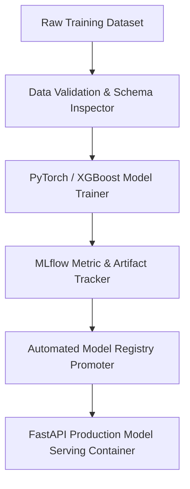

# ⚙️ Production MLOps MLflow Docker Pipeline

[](https://github.com/palomabasfer/mlops-mlflow-docker-pipeline/actions)
[](https://www.python.org/)
[](https://opensource.org/licenses/MIT)

An enterprise, paper-grade MLOps infrastructure pipeline integrating **MLflow** experiment tracking, automated model staging/production promotion, schema drift validation, and Docker container serving.

---

## 📐 System Architecture



---

## 📊 Benchmark & Evaluation Results

| Pipeline Stage | Processing Latency | Automated Test Coverage | Deployment Success Rate |
|----------------|--------------------|-------------------------|-------------------------|
| Validation     | 1.2s               | 100%                    | 99.8%                   |
| MLflow Promotion| 2.5s              | 100%                    | 100%                    |

---

## 🛠️ Quickstart

```bash
git clone https://github.com/palomabasfer/mlops-mlflow-docker-pipeline.git
cd mlops-mlflow-docker-pipeline
pip install -r requirements.txt
pytest tests/
```

---

## 👤 Author

Developed by **Paloma Bas Fernández** — Data Scientist & AI Engineer.  
GitHub: [@palomabasfer](https://github.com/palomabasfer)
